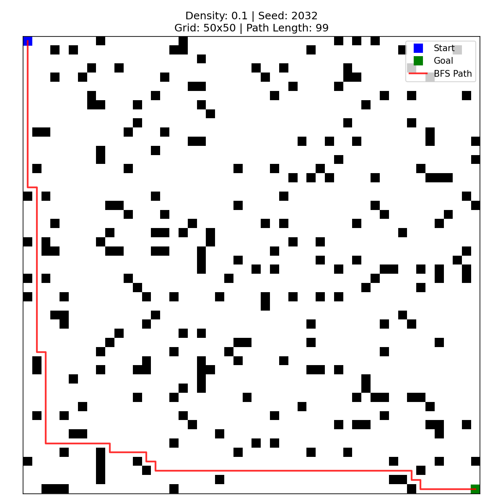
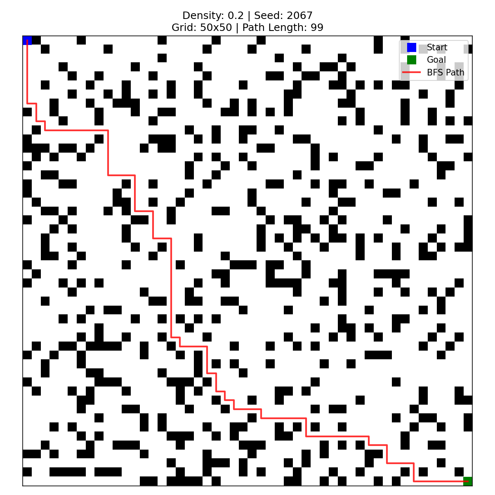
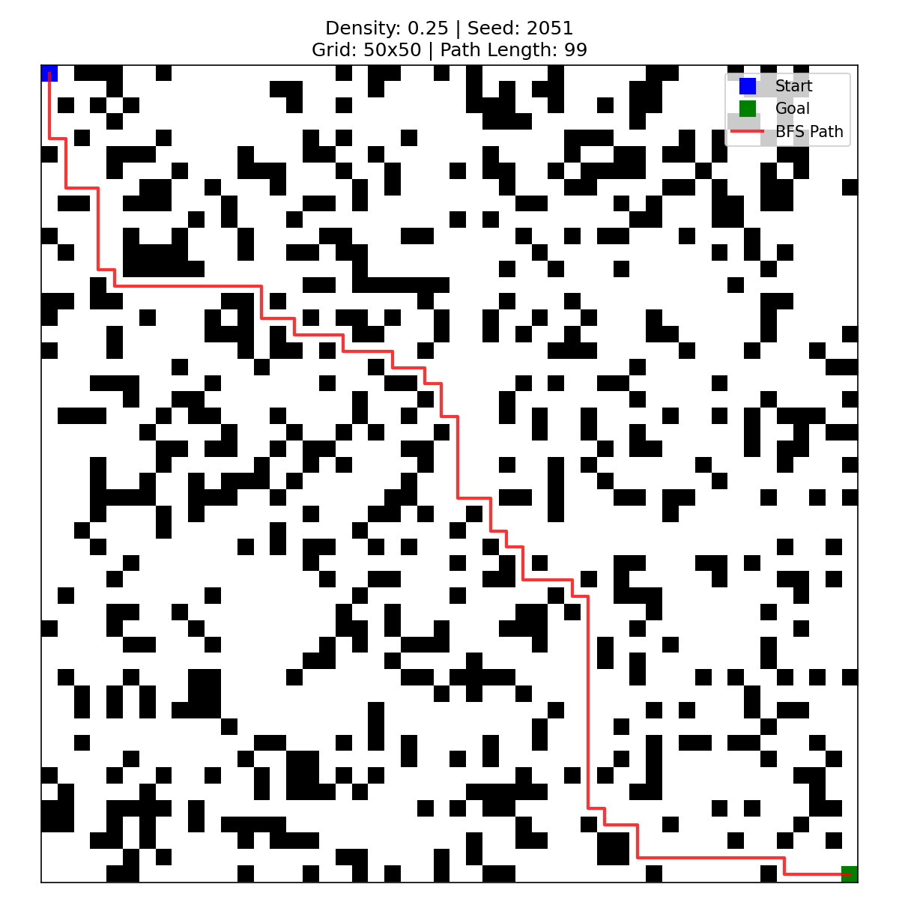
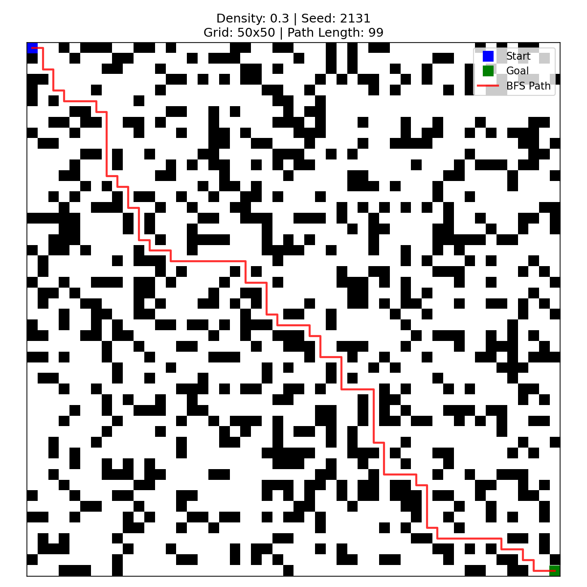
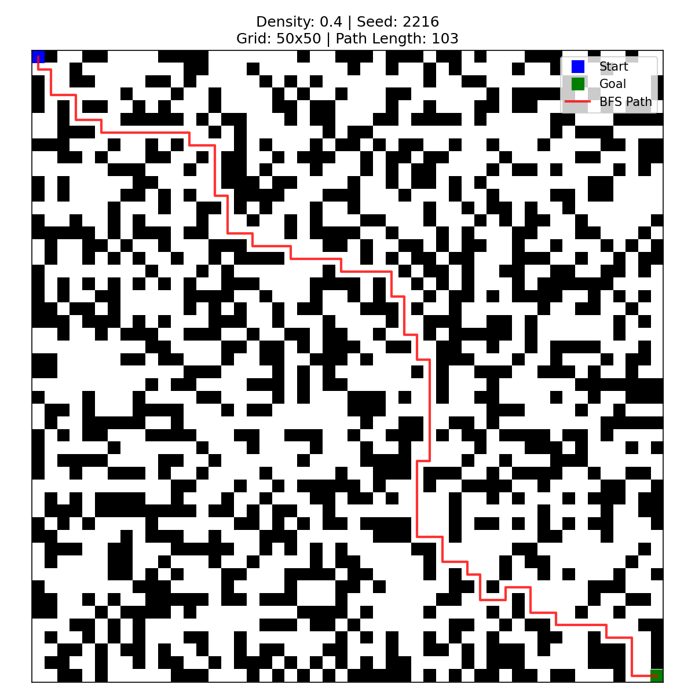

# :fishing_pole_and_fish:Enhanced-Q-DAP for path planning

The official code for article "Enhanced Q-Learning for Grid Navigation: Direction-Sensitive Priors, Annealed Exploration, and Potential-Based Reward Optimization"

**State:** 
- Revising...
- Our draft was submitted to journal [Informatics and Automation](https://ia.spcras.ru/index.php)

---

**File description:**
```
maps - all randomly generated maps (json files)

```

## Visualization of maps
Here we provide visualization comparison of grid maps with different density of obstacles.
<p align="center">
  
  
  
  
  
</p>
